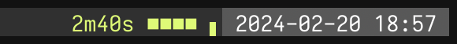
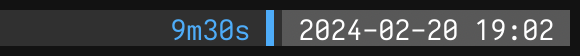

# tmux-tomato

tmux-tomato is a timer inspired by [Teamodoro](https://www.teamodoro.com/) for
use in the tmux status bar. It prints the current state and time left, coloured
using tmux colour syntax.

## Usage

### Install tmux-tomato

```
$ go install github.com/jsageryd/tmux-tomato@latest
```

### Configure tmux

`tmux-tomato` without arguments prints the state and time left. I configure the
status bar like this:

```tmux
set -g status-right-length 200
set -g status-style bg=colour236,fg=colour246

if-shell -b 'which -s tmux-tomato' {
  set -g status-right '#(tmux-tomato)#[fg=colour231,bg=colour240] %Y-%m-%d %H:%M '
} {
  set -g status-right '#[fg=colour231,bg=colour240] %Y-%m-%d %H:%M '
}
```

### Set egg timer (optional)

There is an egg timer mode for ad-hoc timing. Use it like this:

```
$ tmux-tomato 9m30s
```

Or alias to `tt` for speedy egg timing:

```
$ alias tt=tmux-tomato
$ tt 9m30s
```

### Configure focus blocks (optional)
Focus blocks is an attempt at offloading the overhead of keeping track of what
to be focusing on. Define blocks in the evening or the early morning, and then
use them as a guide throughout the day.

If the file `$HOME/.tmux-tomato/blocks` is present, tmux-tomato will read focus
blocks from it. Each line in the file represents one block. Example:

```
09:00 Project A 3h
10:30 Meeting 30m
11:30 Lunch 1h
13:00 Project B 4h
```

tmux-tomato prints the currently active focus block and/or the next focus block.

- There may be gaps between focus blocks.
- Focus blocks may overlap. In this case, the overlapped block continues after
  the overlapping block ends.
- The focus blocks may not span more than 24 hours.
- The focus blocks may span over midnight.
- `□` denotes the first block of the day. `▶` and `▷` denote an upcoming block.
  `▶` means the next block starts directly after the current block ends. `▷`
  indicates that there is a gap between the current block and the next block.

## Examples

### Normal mode




### Focus blocks


### Egg timer

