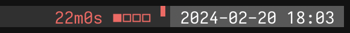

# tmux-tomato

tmux-tomato is a timer inspired by [Teamodoro](https://www.teamodoro.com/) for
use in the tmux status bar. It prints the current state and time left, coloured
using tmux colour syntax.

## Usage

### Install tmux-tomato

```
$ go install github.com/jsageryd/tmux-tomato@latest
```

### Configure tmux

`tmux-tomato` without arguments prints the state and time left. I configure the
status bar like this:

```tmux
set -g status-style bg=colour236,fg=colour246

if-shell -b 'which -s tmux-tomato' {
  set -g status-right '#(tmux-tomato)#[fg=colour231,bg=colour240] %Y-%m-%d %H:%M '
} {
  set -g status-right '#[fg=colour231,bg=colour240] %Y-%m-%d %H:%M '
}
```

### Set egg timer (optional)

There is an egg timer mode for ad-hoc timing. Use it like this:

```
$ tmux-tomato 9m30s
```

Or alias to `tt` for speedy egg timing:

```
$ alias tt=tmux-tomato
$ tt 9m30s
```

## Examples

### Normal mode



### Egg timer

